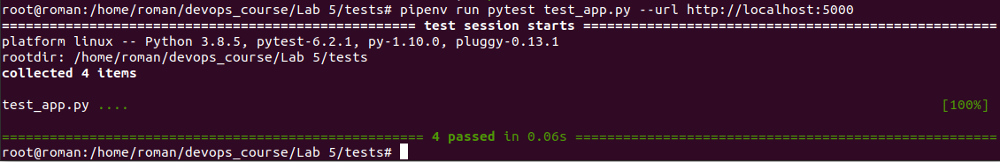
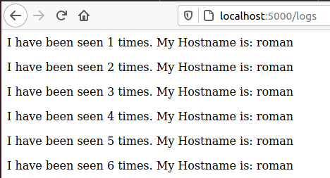
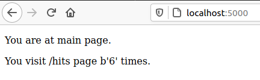

# Lab 5

1. Створив папки проекту та скопіював туди необхідні файли.
2. Спробував запустити проект за допомогою команд
```
pipenv --python 3.8
pipenv install -r requirements.txt
pipenv run python app.py
```
3. Так само спробував запустити тести, проте вони були невдалими, для виправлення цього створив папку для логів та встановив та запустив `redis-server`.



4. Видалив Pipfile та Pipfile.lock.
5. Директиви Makefile:
	1) STATES - змінна для збереження директив;
	2) REPO - змінна для збереження назви Docker репозиторію;
	3) .PHONY - дозволяє оголошувати фальшиві цілі;
	4) $(STATES) - директива для білда контейнера;
	5) run - директива для створення мережі;
	6) test-app - директива для запуску контейнера з тестами
    7) docker-prune - видалення контейнерів, волюмів, мереж та імеджів.

6. Запустив додаток, пройшовся по усім сторінкам, переконався, що він робочий


7. Створив директиву `push` для завантаження у Docker
8. Створив директиву `remove` для видалення локальних імейджів.
9. Створив компоуз файл. У ньому створено дві мережі: public - публічна мережа та secret - для доступу до redis.
10. Веб-сайт працює, адреса - localhost:80
11. Компоуз створив 4 Docker імеджі:  
    bobas/lab4-examples   compose-tests  
    bobas/lab4-examples   compose-app  
    python                3.7-alpine  
    python                3.7-alpine
12. Змінив тег імейджів на свій репозиторій та перезапустив `docker-compose`.
13. Почистив імейджі за допомогою раніше створеною директиви `remove`
14. Зупинив проект, очистив ресурси створені компоузом.
15. Завантажив створені імейджі до Docker за допомогою команди:
```
docker-compose push
``` 
16. На мою думку краще docker-compose.yml;
17. Створив docker-compose.yml для лабораторної №4